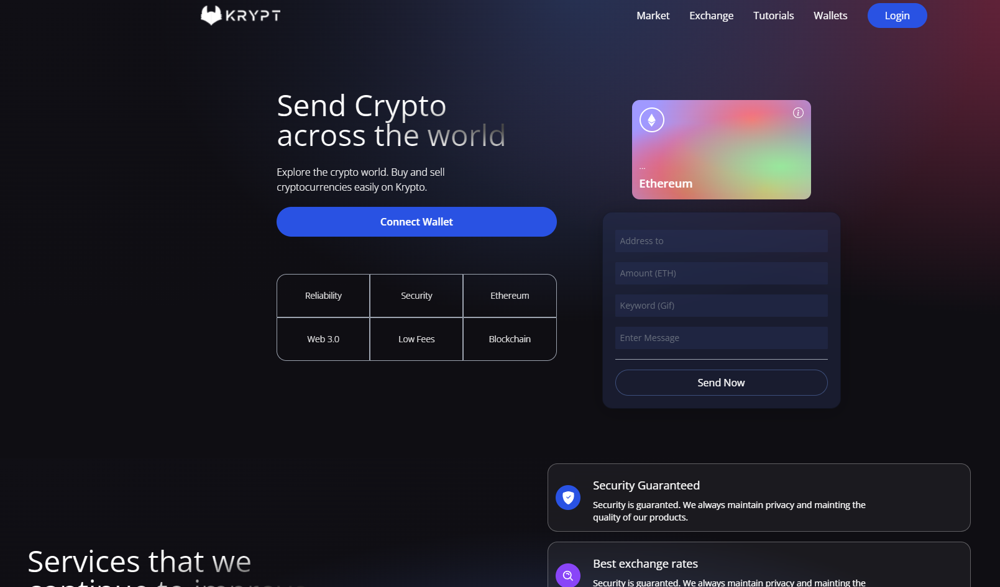

# Kryptea (Web3Afrika Hackathon Build) 💬

<p>
  
  <a href="#" target="_blank">
    
  </a>
</p>

When connecting your wallet to the application, it is possible to view the latest transactions made and send values through the Ethereum network on the blockchain. When sending the values, it is possible to write a keyword in the Keyword (GIF) field. Through Giphy's API, the keyword is associated with a similar gif and then displayed on the transaction card. It is also possible to send a message with the description of the transfer.
 
### ✨ [Live Demo]()

## 🚀 Getting Started

Clone the project and access its folder.

```bash
$ git clone https://github.com/Vinyl-Davyl/web3afrika-hackathon-kryptea.git
```

To start it, follow the steps below:
```bash
# Install dependencies
$ yarn
# Initialize project
$ yarn start
```
The app will be available on your browser at the address http://localhost:3000.


## Problems Talked Down on
<!-- 🪡 Accessibility: Giving web-based chat apps more power with the leverage of been accessed from any device with an internet connection, giving users greater flexibility and convenience.

🪡 No Download Required: Users don't need to download and install a separate app onto their device, saves storage space and reduces the time it takes to get started.

🪡 Cross-Platform Compatibility: TalkuTalku works across multiple platforms, including desktops, laptops, smartphones, and tablets, making them more accessible to a wider range of users.

🪡 Easy Integration: Web-based chat apps can easily integrate with other web applications or services, such as social media platforms, email, and project management tools.

🪡 SEO Benefits: Web-based chat apps can help improve website traffic and visibility through search engine optimization (SEO), as they can be optimized for specific keywords.

to name a few... -->

- Lack of transparency: The application allows users to view their latest transactions made through the Ethereum network on the blockchain, which can increase transparency and provide greater visibility into one's transaction history.

- Limited functionality: By allowing users to send values and messages with description, the application provides additional functionality beyond what is typically offered by a regular wallet application.

- Boring or unengaging user experience: By associating keywords with GIFs through Giphy's API, the application adds an element of fun and whimsy to the transaction process, potentially making it more engaging for users.

- Difficulty in associating transfers with a specific context: By allowing users to include descriptions with their transfers, the application makes it easier to associate a transfer with a specific context (e.g. "rent payment" or "coffee with friends") rather than just a generic value transfer.


## Support is contiguous 

Leave a ⭐️ If this project got you going!
<p>
  <a href="https://www.buymeacoffee.com/VinylDavyl"> </a>
</p>
<br /><br /><br />

## Stack
This project was developed using the following technologies and resources:

- [React](https://reactjs.org)
- [Vite](https://vitejs.dev/)
- [Tailwind](https://tailwindcss.com/)
- [Solidity](https://docs.soliditylang.org/)
- [Metamask](https://metamask.io/)
- [Alchemy](https://www.alchemy.com/)
- [Giphy](https://www.alchemy.com/)
- [Bunzz](https://www.bunzz.dev)


## Features
<!-- ### From V2
- [x] Users can register/login via username and password.
- [x] Generate random avatars using [MultiAvatar](https://api.multiavatar.com/) API
- [x] Emoji picker Integrated.
- [x] Users can browse and skim through active users
- [x] Cross-Platform Compatibile

 ### Update on Features come V3
- [x] Full Migration to Typescript for scalability
- [x] Profile section where users can update their avatars with actual selected image
- [x] User should be abould to send photos and images while conversating
- [x] Users should be able to update already set profile image, after profile creation
- [x] UI Update -->

## Prerequisite     
1. Have MetaMask extension installed.
2. Have Node.js version 16^ installed.
3. Add and switch to the Polygon network on your MetaMask wallet(For already deployed smart contract on bunzz).

## To deploy your own kryptea-version smart contract on bunzz
- Create an account on the Bunz website and log in.
- Click on connect wallet to connect your MetaMask wallet to Bunzz. switch to the Polygon network on your MetaMask wallet.
- Click on create Dapp. Give your Dapp any name of your choice. Then click Next.
- Select polygon Mumbai Testnet(For the purpose of test case as compared to Mainnet) as the network name. Then  click Next.
- Go to prepared templates. You will see a list of already written templates/smart contracts awaiting deployment.
- Using the first template named simple Token. Click on use the template.
- Give your Token a name(any name of choice), and a unique symbol. for example, if the token name is ‘Kryptea Token’, then the symbol can be ‘KT’.
- Before you deploy, you need to have enough tokens in your wallet, otherwise, your contract will not be deployed to the blockchain. Go to polygon faucet and get free Testnet to use for deployment.
- Click on deploy. your MetaMask wallet will pop up on your screen for you to confirm the transaction.
- Click on back to dashboard and Copy your contract ABI and contract address.
- To verify your transaction, paste your contract address on PolygonScan Testnet
## Sneak Peek

<h1 align="center">
    
</h1>


## 📝 License

This project is licensed under the MIT license. See the LICENSE file for more details. [LICENSE](https://github.com//Vinyl-Davyl/web3afrika-hackathon-kryptea/blob/main/LICENSE)

---

## Author

👤 **Vinyl Davyl** <br/>
Leave a ⭐️ If this project got you going!
- Website: https://vinyldavyl.netlify.app
- Twitter: [@Vinylchi](https://twitter.com/Vinylchi)